## Smart Questions
In my experience when asking questions it is best to be *able*

to tell the answerer everything you have already tried, but

don't frontload your question with all this information.

Additionally, when asking a question is to be able to accept

the answer, "I don't know."

## Free Culture
Chapter 3 of Free Culture exposes issues with the legal system

in America. One issue is the exorbitant legal fees associated

with fighting for your rights in court, especially against a

large entity like the RIAA. If somebody cannot afford a lawyer

they are appointed a public defender whom has to familiarize

themselves with cases they may have no expertise in. In a case

such as the one in the chapter to adequately make a case the

public defender would have to be knowledgeable in matters of

technology, file sharing, fair use, etc. After learning all

of this information the lawyer is still likely competing

against a team of lawyers whom specialize in this type of

case. Another issue with the legal system is the extortion

of people who cannot fight back. The RIAA took every cent

Jordan had saved in settlement of a supposedly 15 million

dollar case. It's ridiculous to suggest that each alleged

infringement is worth $150,000 in damages to the copyright

holder.

## Tree

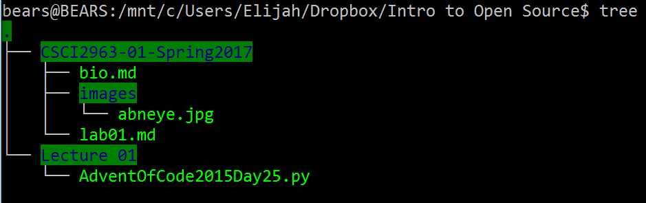

## Crossword

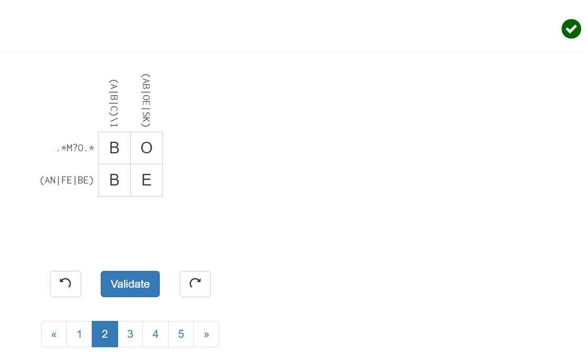

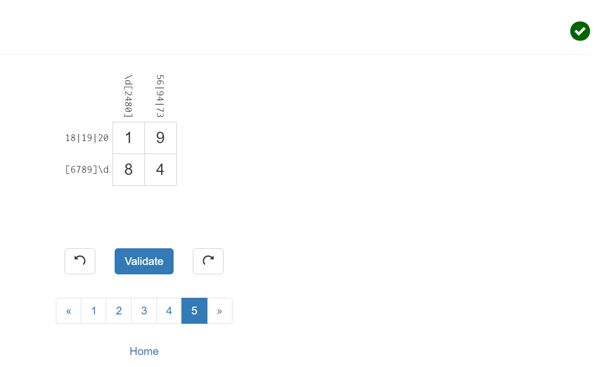

## Regex

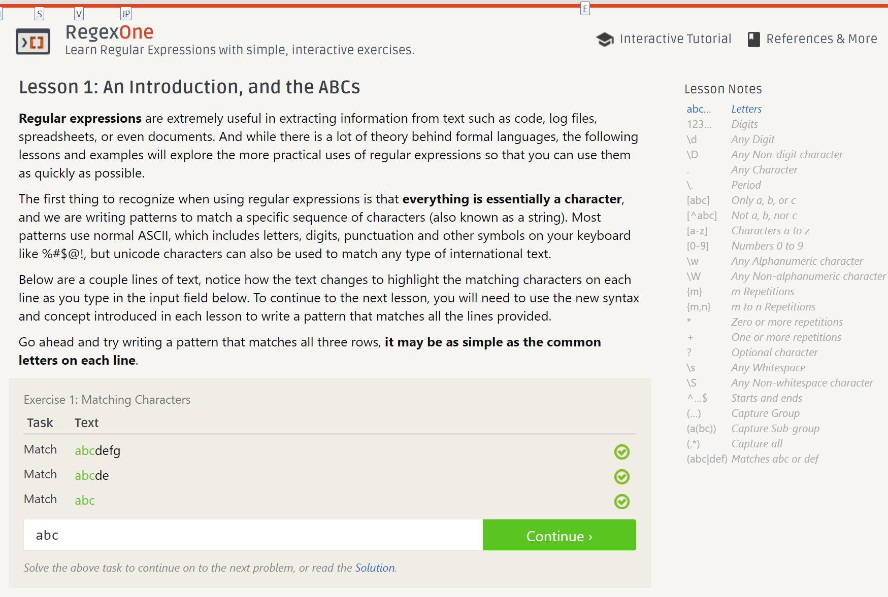
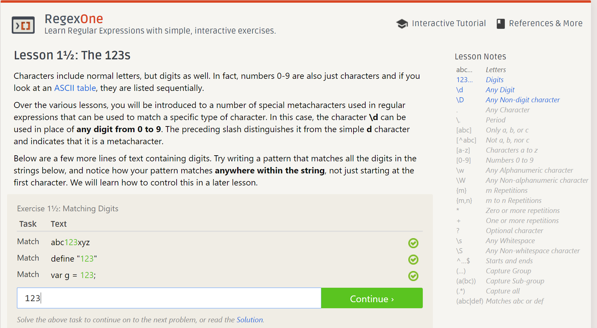
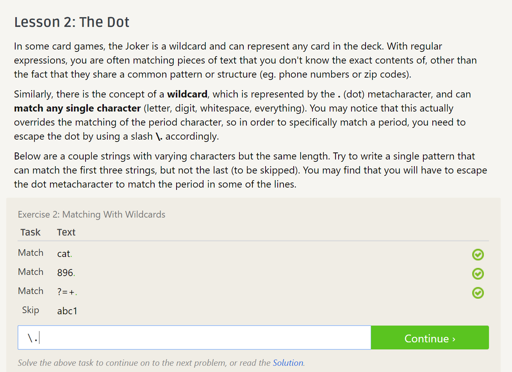
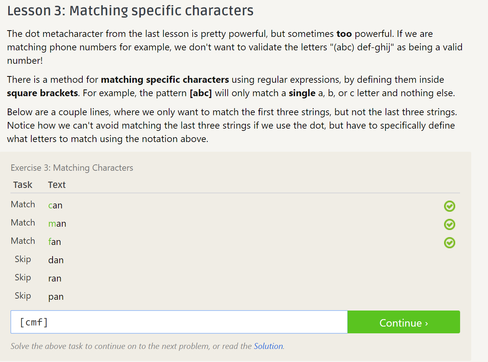
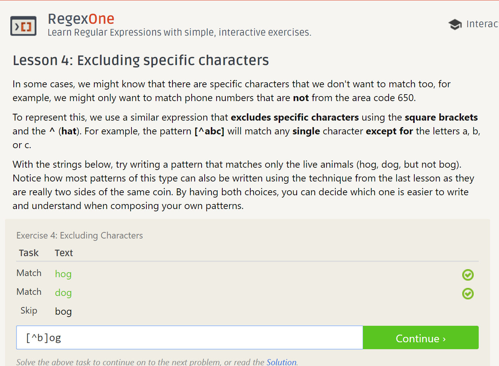
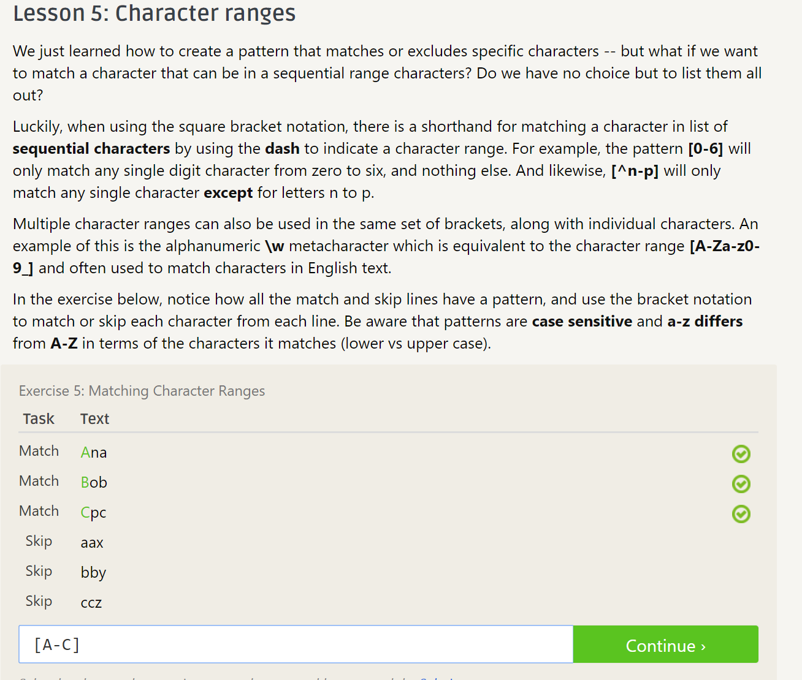
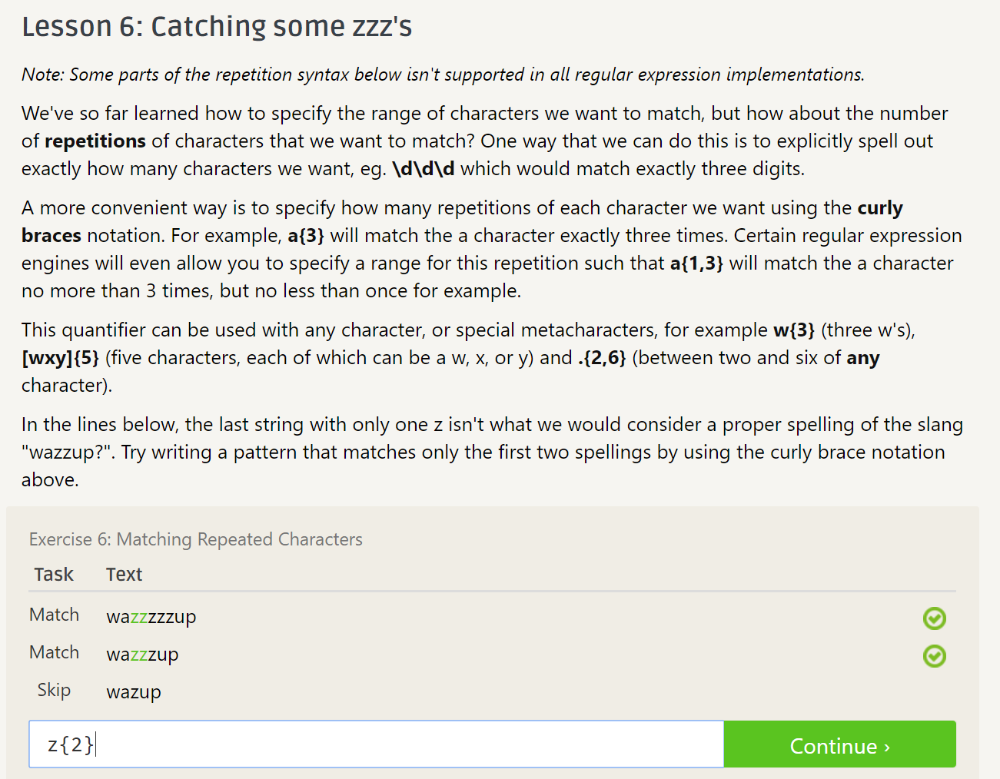
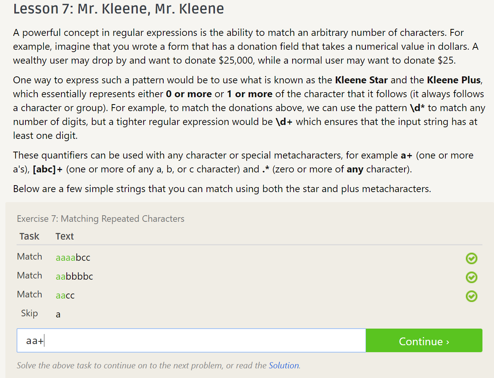

## Blockly

## Reflection

I'd like to contribute to one of the campus open source projects
such as the shuttle tracker of yacs.
